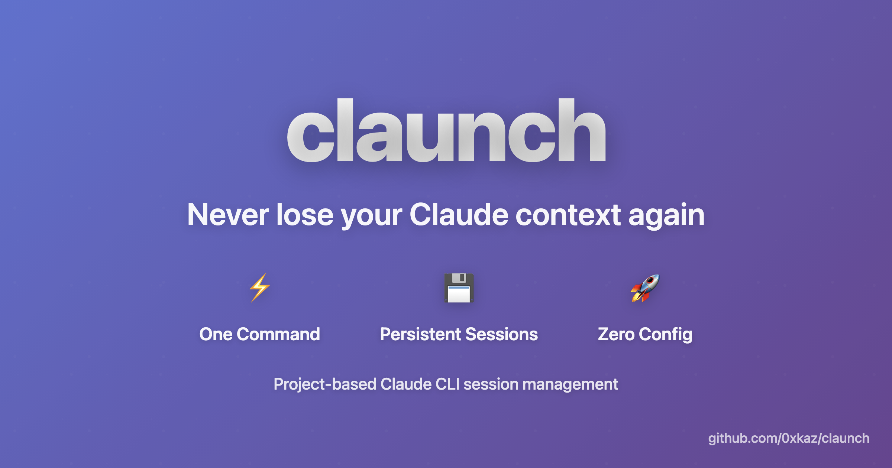

# claunch 🧠🚀



[](README.ja.md)

> A lightweight session manager for efficiently managing Claude CLI across multiple projects

`claunch` is a development support tool that separates Claude sessions by project with optional tmux support for persistent interaction.

- 🧠 Claude session management per project (automatic resume)
- ⚡ Lightweight direct execution by default
- 🧰 Optional tmux support for persistent sessions
- 💻 Supports macOS / Debian-based Linux
- 🔐 Automatically includes `--dangerously-skip-permissions` flag
- 🔄 Easy session ID storage and reuse

---

## 🚀 Installation (One-liner)

```bash
bash <(curl -s https://raw.githubusercontent.com/0xkaz/claunch/main/install.sh)
```

Or with wget:

```bash
bash <(wget -qO- https://raw.githubusercontent.com/0xkaz/claunch/main/install.sh)
```

> **Note**: This will install `claunch` to `$HOME/bin/claunch`. Make sure `$HOME/bin` is in your PATH.

---

## ⚠️ Security Notice

`claunch` automatically runs Claude CLI with the `--dangerously-skip-permissions` flag. This means:

- **Claude will have full access to your file system** without asking for permissions
- **All file read/write operations will be executed immediately** without confirmation
- **Use with caution** and only in trusted project directories
- **Not recommended for production environments** or sensitive data

This flag is included for development convenience, allowing Claude to work efficiently without permission prompts. However, be aware of the security implications when using this tool.

---

## 📖 Usage

### 1. Start a new Claude session

Navigate to your project directory and run:

```bash
claunch        # Start direct Claude session (default)
claunch --tmux # Start with tmux for persistent sessions
```

On first run, it will:
- Install tmux automatically if not present (tmux mode only)
- Start a new Claude session
- Display the session ID to save

#### Direct Mode vs tmux Mode

- **Direct mode** (default): Lightweight, no tmux dependency, direct Claude interaction
- **tmux mode** (`--tmux`): Persistent sessions, background execution, scroll history

### 2. Save the session ID

When Claude starts, you'll see a session ID like `sess-xxxxxxxx`. Save it:

```bash
echo "sess-xxxxxxxx" > ~/.claude_session_PROJECT_NAME
```

### 3. Resume an existing session

Just run `claunch` (or `claunch --tmux`) again in the same project directory. It will automatically:
- Detect the saved session ID
- Resume your previous Claude conversation
- Maintain all context from before

### 4. Additional Commands

```bash
claunch list     # List all active sessions
claunch clean    # Clean up orphaned session files
claunch --help   # Show help and options
```

---

## 🛠 Features

### Auto tmux Installation (when using --tmux)

`claunch` automatically detects and installs tmux if not present when using `--tmux` option:

- **macOS**: Uses Homebrew (`brew install tmux`)
- **Debian/Ubuntu**: Uses apt (`sudo apt install tmux`)
- **Other systems**: Provides manual installation instructions

### Project-based Session Management

Each project gets its own:
- Session ID file at `~/.claude_session_PROJECT_NAME`
- Isolated Claude conversation context
- Optional tmux session named `claude-PROJECT_NAME` (with `--tmux`)

### Persistent Sessions (tmux mode)

With `claunch --tmux`:
- Sessions survive terminal closures
- Reconnect anytime with `claunch --tmux`
- Multiple projects can run simultaneously in background

### tmux Operation Guide

When running Claude through `claunch --tmux`, you're in a tmux session. Here are essential commands:

- **Detach from session**: Press `Ctrl+B` then `D`
  - This leaves Claude running in the background
  - Return to your normal terminal
- **Scroll up/down**: Press `Ctrl+B` then `[` to enter copy mode
  - Use arrow keys or Page Up/Down to scroll
  - Press `q` to exit copy mode
- **Copy text**: In copy mode (`Ctrl+B` then `[`):
  - Move cursor to start position
  - Press `Space` to start selection
  - Move to end position
  - Press `Enter` to copy
- **Paste text**: Press `Ctrl+B` then `]`
- **Kill session**: Press `Ctrl+B` then `&` (use with caution)

> **Tip**: You can also manually attach to sessions with `tmux attach -t claude-PROJECT_NAME`

---

## 📝 Requirements

- Claude CLI (`claude` command)
- tmux (auto-installed if missing)
- macOS or Debian-based Linux
- curl or wget for installation

---

## 🤔 FAQ

### Why use claunch?

- **Project isolation**: Keep Claude conversations separate by project
- **Session persistence**: Never lose your context when closing terminal
- **Automatic setup**: No manual tmux configuration needed
- **Multi-tasking**: Work on multiple projects simultaneously

### How do I switch between projects?

Simply `cd` to a different project directory and run `claunch`. Each project maintains its own session.

### Where are session IDs stored?

Session IDs are stored in your home directory as `.claude_session_PROJECT_NAME` files.

### Can I manually attach to tmux sessions?

Yes! Sessions are named `claude-PROJECT_NAME`, so you can:

```bash
tmux attach -t claude-myproject
```

---

## 🐛 Troubleshooting

### "tmux not found" error

The script should auto-install tmux. If it fails:
- **macOS**: Install Homebrew first from https://brew.sh
- **Linux**: Ensure you have sudo permissions
- **Other**: Install tmux manually from https://github.com/tmux/tmux

### Session ID not found

1. Make sure you saved the session ID correctly
2. Check the file exists: `ls ~/.claude_session_*`
3. Verify the session ID format: `sess-xxxxxxxx`

### Can't resume session

If Claude can't resume your session:
1. The session may have expired
2. Start a new session and save the new ID
3. Check Claude's documentation for session limits

---

## 📄 License

MIT License - feel free to use and modify!

---

## 🤝 Contributing

Pull requests welcome! Please:
1. Fork the repository
2. Create your feature branch
3. Commit your changes
4. Push to the branch
5. Open a pull request

---

Made with ❤️ for the Claude community